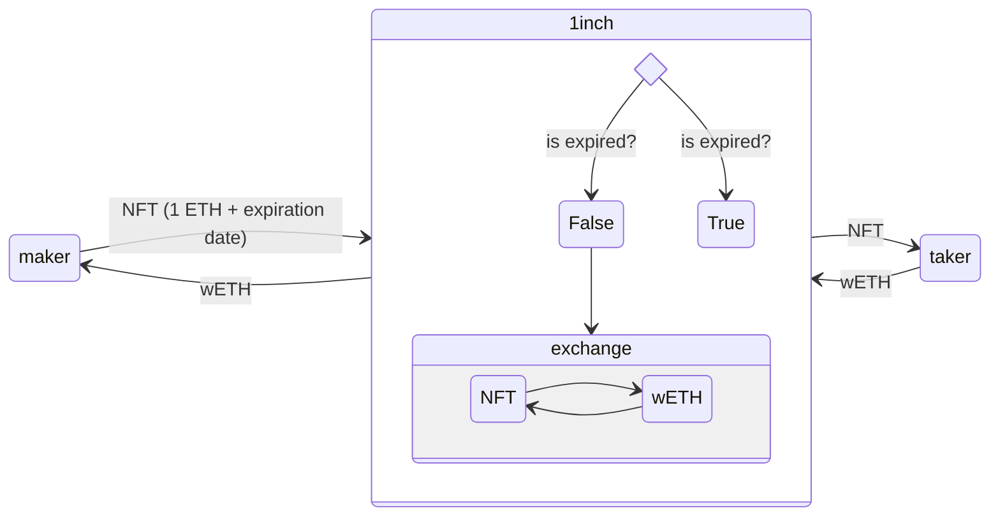

#  Sale expiration ( Predicate )

```mermaid
stateDiagram
direction LR
    maker --> 1inch:NFT (1 ETH + expiration date)
    1inch --> maker:wETH
     state 1inch {
      state exchange {
      direction LR
      NFT --> wETH
      wETH --> NFT
      }
        state is_expired_predicate <<choice>>
        is_expired_predicate --> False: is expired?
        is_expired_predicate --> True : is expired?
      False --> exchange
    }
    1inch --> taker:NFT
    taker --> 1inch:wETH
```
