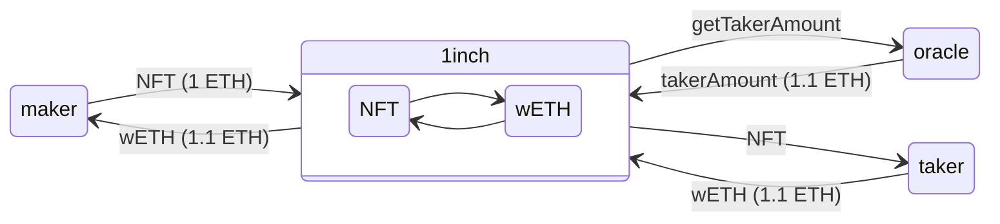

#  Variable price depending on the market conditions ( getTakerAmount )

```mermaid
stateDiagram
direction LR
    maker --> 1inch:NFT (1 ETH)
    1inch --> maker:wETH (1.1 ETH)
     state 1inch {
      direction LR
      NFT --> wETH
      wETH --> NFT
    }
    oracle --> 1inch:takerAmount (1.1 ETH)
    1inch --> oracle:getTakerAmount

    1inch --> taker:NFT
    taker --> 1inch:wETH (1.1 ETH)
```
