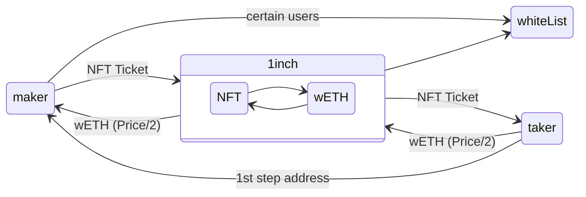

## Whitelist

```mermaid
stateDiagram
direction LR
    maker --> 1inch:NFT Ticket
    maker --> whiteList: certain users
    1inch --> maker:wETH (Price/2)
    1inch --> whiteList
    state 1inch {
      direction LR
      NFT --> wETH
      wETH --> NFT
    }
    1inch --> taker:NFT Ticket
    taker --> 1inch:wETH (Price/2)
    taker --> maker:1st step address
```
